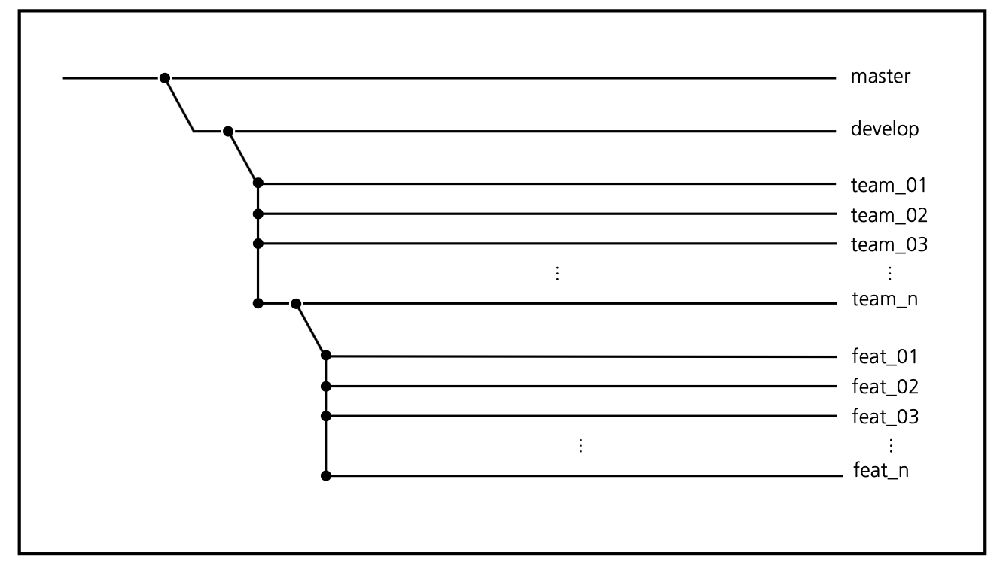

### 개발실무팀플 WorkFlow  
#### Member  
## 개발실무팀플 WorkFlow  

 

### **Member**  
팀장 : 이정인 소프트웨어학부 2018044911  
팀원 : 신민경 소프트웨어학부 2019037129   
팀원 : 김현진 ICT융합학부 2019031430  

- 가정  
  우리 팀은 A회사에서 진행하는 B프로젝트에 참여하고 있다. 이 프로젝트는 여러 팀이 참여하고 있으며, 각 팀 별로 필요한 기능을 분담하여 서로 다른 디렉토리에 작업한다.  
 

### **가정**  
____
우리 팀은 A회사에서 진행하는 B프로젝트에 참여하고 있다. 이 프로젝트는 여러 팀이 참여하고 있으며, 각 팀 별로 필요한 기능을 분담하여 서로 다른 디렉토리에 작업한다.  
  즉, 각 팀의 작업은 서로 영향을 주지 않게끔 한다. 
  팀 별로 맡게 된 기능도 세분화하여 팀원이 분업할 수 있다. 

 

### **TODO - 프로젝트리더**  
___
프로젝트 리더가 B 프로젝트 repository를 개설한 후, master 브랜치에는 정식 출시 버전만 올릴 수 있도록 개발 버전을 저장하기 위한 develop 브랜치를 만든다. 
또, 각 팀 별로 개발을 나누어 할 수 있도록develop 브랜치를 여러 개의 team 브랜치로 나눈다. 

 

### **TODO - 팀장**
___
팀장은 B프로젝트 repository를 fork한 후(github을 활용한다.),  

자신의 팀 번호에 해당하는 team 브랜치를 개발할 기능을 세분화하여 그에 따른 브랜치들을 만든다.  

이를 feature 브랜치라고 하자.

