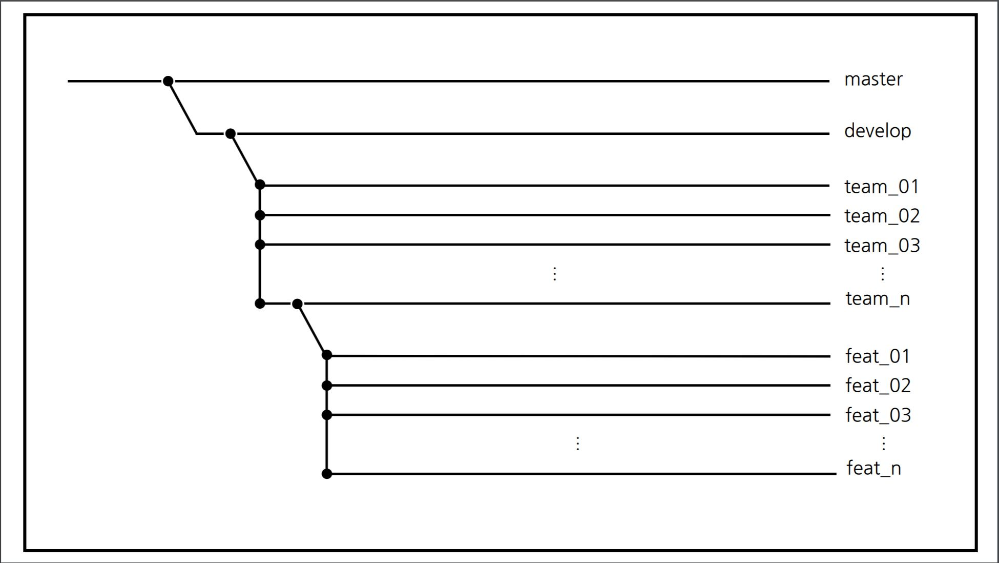
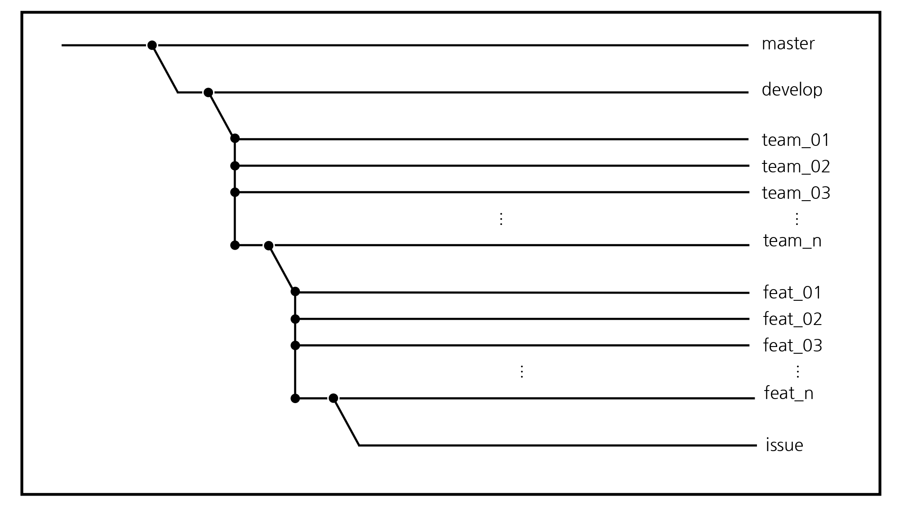
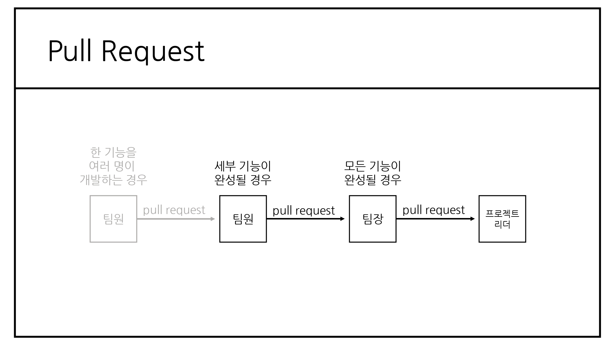
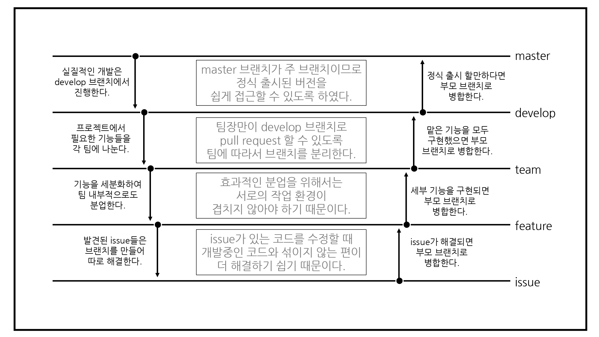

## 개발실무팀플 WorkFlow  

 

### **Member**  
팀장 : 이정인 소프트웨어학부 2018044911  
팀원 : 박준성 소프트웨어학부 2019052581  
팀원 : 신민경 소프트웨어학부 2019037129   
팀원 : 김현진 ICT융합학부 2019031430  
팀원 : 하현우 소프트웨어학부 2019036844 
 
### **가정**  
____
우리 팀은 A회사에서 진행하는 B프로젝트에 참여하고 있다. 이 프로젝트는 여러 팀이 참여하고 있으며, 각 팀 별로 필요한 기능을 분담하여 서로 다른 디렉토리에 작업한다.  
  즉, 각 팀의 작업은 서로 영향을 주지 않게끔 한다. 
  팀 별로 맡게 된 기능도 세분화하여 팀원이 분업할 수 있다. 

 

### **TODO - 프로젝트리더**  
___
프로젝트 리더가 B 프로젝트 repository를 개설한 후, master 브랜치에는 정식 출시 버전만 올릴 수 있도록 개발 버전을 저장하기 위한 develop 브랜치를 만든다. 
또, 각 팀 별로 개발을 나누어 할 수 있도록develop 브랜치를 여러 개의 team 브랜치로 나눈다. 

 

### **TODO - 팀장**
___
팀장은 B프로젝트 repository를 fork한 후(github을 활용한다.),  

자신의 팀 번호에 해당하는 team 브랜치를 개발할 기능을 세분화하여 그에 따른 브랜치들을 만든다.  

이를 feature 브랜치라고 하자.

 

### **TODO - 팀원**  
팀원은 팀장이 fork한 repository를 fork한 후, 
자신이 맡은 feature 브랜치를 checkout하여 개발을 진행한다. 
  
  - 한 feature 브랜치에서 여러 인원이 개발을 진행할 경우 
인원 중 한 명의 repository를 골라 다른 인원들은 해당 repository를 fork하여 개발을 진행하도록 한다. 
이때, slack 등의 협업 도구를 적극 활용하여 개발 상황(현재 작업중인 파일 등)을 공유하도록 한다. 

  - 개발 중에 issue가 발생할 경우 
issue가 발생한 feature 브랜치에서 issue를 해결하기 위한 issue 브랜치를 따로 하나 생성하여   
개발 상황과 issue 처리 상황을 구분한다.  
issue 처리가 완료되면 issue 브랜치를 부모 브랜치로 합병한 후 해당 브랜치는 제거한다.  

 

### **PR & merge 규칙**
  1. 프로젝트는 계층적인 구조를 띤다. (issue ⊂ feature ⊂ team ⊂ project)
  2. 모든 개발은 상위 원격 저장소 중 가장 가까운 저장소를 자신의 repository로 fork한 후에 진행하도록 한다.
  3. branch 간 merge는 함부로 하지 않는다. merge 권한은 다음을 따르도록 한다. 
  &nbsp;- 개발자: issue→feature 
  &nbsp;- 팀장: feature→team 
  &nbsp;- 프로젝트 리더: team→develop→master
  4. 각 개발자는 feature 브랜치에서 작업을 마친 뒤, 팀장의 repository에 PR을 보낸다.
  5. 각 팀장은 해당 팀에서 맡은 모든 기능이 구현되었다면, 프로젝트 리더의 repository에 PR을 보낸다.
  6. 모든 프로젝트 구성원은 PR을 보내기 전, 자신의 권한 내에 있는 최상위 branch까지 merge를 완료하도록 한다.

 
